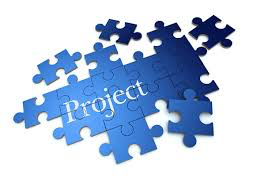

=======
TomoLab
=======

This web site contains the documentation of the TomoLab meetings. 

These meetings aim to share and discuss best practices and solutions used in the development of the control and data analysis system for a custom designed tomography instrument.

Topic of discussion includes integration of X-ray source, motion control, data and meta-data capturing models, detector and data analysis infrastructure.

Content
-------

.. toctree::
   :maxdepth: 1

   source/meetings
   source/demo
   source/credits
